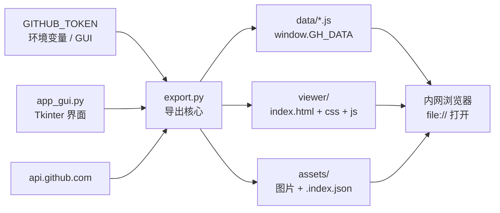

# 项目架构与数据流地图

> 本文档描述当前版本中 Mirror_export 工具的整体架构、导出流水线、增量缓存机制、数据文件格式与查看器渲染边界。
> 任何修改导出逻辑、data 结构或查看器视图前，请先阅读本文档，确保变更不破坏 `export.py` → `data/*.js` → `viewer` 的链路。

## 1. 项目概述

本项目用于在外网把 GitHub 仓库导出为自包含静态站，拷入内网后双击 `index.html` 即可浏览。主要支持：

- 拉取 PR / Issue / Commit / Tag / Release / Branch / 文件树；
- 为 PR、Issue、Commit 拉取详情（diff、评论、文件列表）；
- Release 与上一 Tag 的 compare，并从 release body 关联 `#123` PR；
- 下载 README 等图片资源到本地 `assets/`；
- 下载 PR / Issue / Release 正文与评论中的外链图片到 `assets/externals/`，并写入 `meta.image_map`；
- 增量导出：复用上次缓存，只拉有变化的内容；
- 纯静态查看器：概览 / PR / Issue / Commit / Release / 版本对比 / 文件浏览 / README。

运行角色分离：

| 角色 | 环境 | 入口 |
|------|------|------|
| 外网导出 | 有 GitHub 访问 + Token | `export.py` 或 `app_gui.py` / `dist/Mirror_export.exe` |
| 内网浏览 | 无外网、无写权限 | 导出包内 `index.html` |

## 2. 顶层架构



### 目录结构

```
Mirror_export/
├── AGENTS.md                      项目要求与协作约定
├── ARCHITECTURE.md                架构与数据流说明
├── README.md                      使用说明
├── export.py                      导出核心（CLI + 库）
├── app_gui.py                     图形界面入口
├── viewer/                        查看器模板（导出时复制到输出目录）
│   ├── index.html                 壳页面，按序加载 data/*.js
│   ├── css/app.css                GitHub Light 风格样式
│   └── js/app.js                  路由、列表、详情、diff、文件树
├── preview/                       本地演示包（无 GitHub 时可打开）
├── sample/                        示例数据（结构同 preview/data）
├── data/                          开发/调试用数据样例
├── assets/                        图标与 README 配图
├── dist/
│   ├── Mirror_export.exe          打包后的 GUI 导出工具
│   └── gh_token_cache.json        本机 Token/路径缓存（不进导出包）
└── _inspect_readme.py             辅助检查脚本
```

导出输出目录（可拷入 U 盘）：

```
gh-mirror-<owner>-<name>-<date>/
├── index.html
├── css/app.css
├── js/app.js
├── data/
│   ├── meta.js
│   ├── prs.js
│   ├── issues.js
│   ├── commits.js
│   ├── tags.js
│   ├── releases.js
│   ├── files.js
│   ├── branches.js
│   └── manifest.json
└── assets/
    ├── .index.json                path/blob sha + ext:<url> → 本地相对路径（增量判断）
    ├── externals/                 PR/Issue/Release 正文外链图片
    └── <repo images...>
```

## 3. 数据流向

主导出链路如下：

```
Token + --repo owner/name + --out 目录
        ↓
export.export(args)
        ↓
1) 可选：load_previous_export / load_asset_index 读取增量缓存
2) GET /repos/{repo}                 → meta
3) tags + releases
4) 每个 release 对上一 tag compare   → compare.commits / files
5) commits（本轮窗口 max_commits）
      · 缓存命中则复用
      · 需要时 GET /commits/{sha} 补 diff
      · 历史缓存中不在本轮窗口的 commit 一律保留
6) pulls?state=all&sort=created&direction=desc
      · 列表按编号从新到旧（创建顺序，大号在前）
      · updated_at 未变且已有 files → 整条复用
      · 否则拉 files / commits / comments
7) issues（过滤 pull_request，sort=created&direction=desc）
      · 列表按编号从新到旧
      · updated_at 未变且已有 comments → 复用
      · closed issue 尽量补 closed_by_pr（PR body 或 timeline）
8) git/trees?recursive=1
      · 文本且 size ≤ max_file_bytes 时缓存 contents
      · blob sha 未变则复用正文
9) download_repo_images → assets/（sha 未变则跳过）
10) collect_body_image_urls + resolve_attachment_aliases + download_body_images
      · 扫描 PR/Issue 正文与评论、Release body 中的 Markdown/HTML 图片 URL
      · 私有库 `github.com/user-attachments/assets/*` 直链常 404：经 GraphQL `bodyHTML`
        解析成 `private-user-images.githubusercontent.com/...?jwt=...` 再下载（JWT 约 5 分钟有效，导出时即时拉取）
      · 外链下载到 assets/externals/；树内 raw URL 直接映射已有 assets
      · 写出 meta.image_map：原始 URL → assets 相对路径（键仍是 markdown 里的原始 URL）
11) branches
        ↓
copy_viewer + 写出 data/*.js + manifest.json
```

## 4. 入口说明

### 4.1 `export.py`（核心）

```powershell
$env:GITHUB_TOKEN = "ghp_xxx"
python export.py --repo owner/name
python export.py --repo owner/name --out gh-mirror --force
python export.py --repo owner/name --skip-details --no-contents
python export.py --repo owner/name --full   # 强制全量
```

主要 CLI 参数：

| 参数 | 默认 | 含义 |
|------|------|------|
| `--repo` | 必填 | `owner/name` |
| `--out` | `gh-mirror-<repo>-<date>` | 输出目录 |
| `--token` | 环境变量 | 覆盖 `GITHUB_TOKEN` |
| `--incremental` / `--full` | 增量开 | 是否复用上次 `data` 缓存 |
| `--force` | 关 | 允许覆盖非空输出目录 |
| `--max-prs` / `--max-issues` / `--max-tags` | 0=GUI 默认有上限，CLI 0 表示尽量多 | 数量上限 |
| `--max-commits` | 100 | 每轮从 HEAD 往回爬的 commit 窗口 |
| `--max-commit-diffs` | 同 max-commits | 本轮最多新拉多少条 commit diff |
| `--max-file-bytes` | 400000 | 单文件正文缓存上限 |
| `--skip-details` | 关 | 不拉 diff/评论，更快 |
| `--no-contents` | 关 | 只保留文件树，不缓存源码 |
| `--no-assets` | 关 | 不下载图片 |

关键函数：

- `http_get`：带 Bearer Token、重试、RateLimit 等待；
- `paginate`：`per_page=100` 翻页，`max_items<=0` 表示尽量拉全；
- `map_pr` / `map_issue` / `map_commit` / `map_file`：把 GitHub API 裁剪成镜像用的精简结构；
- `js_assign` / `parse_data_js`：`data/*.js` 写出与回读（增量合并的基础）；
- `load_previous_export` / `load_asset_index`：读取上次导出包；
- `download_repo_images`：按 blob sha 增量下载图片；
- `progress`：同时输出人类可读日志与 `__PROGRESS__{json}` 供 GUI 解析。

### 4.2 `app_gui.py`（外网图形界面）

职责：

- 收集 Token / 仓库 / 输出目录 / 数量上限 / 增量与跳过详情等选项；
- 后台线程调用 `export_mod.export(args)`；
- 用 `queue` + `after` 轮询消费日志与 `__PROGRESS__`；
- 可选把 Token、仓库、输出路径写入 exe 同目录 `gh_token_cache.json`（最多 8 条，UI 侧掩码显示）。

注意：Token 缓存只在外网导出机本地，**不会**写入导出包。

### 4.3 `viewer/`（内网查看器）

- `index.html` 固定按序加载 8 个 `data/*.js`，再加载 `js/app.js`；
- `app.js` 从 `window.GH_DATA` 读数据，用 hash 路由切换视图；
- 视图：`overview` / `prs` / `issues` / `commits` / `tags` / `compare` / `files` / `readme`；
- 详情页支持：PR 文件 diff、Issue 评论、Commit message 与文件、Release compare 摘要、文件树与已缓存文本源码；
- 正文中的 `#123` 与同仓库 GitHub 链接会被改写为站内跳转。

## 5. data/*.js 数据格式

统一形式：

```js
window.GH_DATA=window.GH_DATA||{};window.GH_DATA.<name>=<compact-json>;
```

| 文件 | 顶层类型 | 核心字段 |
|------|----------|----------|
| `meta.js` | object | `repo`、`default_branch`、`exported_at`、`incremental`、`limits`、`file_stats`、`image_map` |
| `prs.js` | array | `number`、`title`、`state`、`merged`、`files[]`、`issue_comments[]`、`commits_list[]` |
| `issues.js` | array | `number`、`title`、`state`、`issue_comments[]`、`closed_by_pr` |
| `commits.js` | array | `sha`、`message`、`files[]`、`stats`、`has_diff`、`parents[]` |
| `tags.js` | array | `name`、`sha` |
| `releases.js` | array | `tag_name`、`body`、`compare`、`related_prs[]` |
| `files.js` | object | `tree[]`（path/type/size/sha）、`contents{path→text}`、`truncated` |
| `branches.js` | array | `name`、`sha`、`protected` |

`files.contents` 中的路径与 `tree` 一致；图片正文不进 contents，而落到 `assets/<path>`，由查看器按相对路径引用。

`meta.image_map` 为 `{ 原始URL: "相对 assets 的路径" }`，例如：

```json
{
  "https://github.com/user-attachments/assets/xxxx": "externals/ab12cd34ef56.png",
  "https://raw.githubusercontent.com/owner/name/main/docs/a.png": "docs/a.png"
}
```

查看器 `mdSrc()` / HTML `` 在渲染时优先查该表，命中则输出 `assets/<mapped>`；未命中的 `http(s)` 外链仍原样保留（外网可显示，内网走 `onerror` 标记为损坏）。

## 6. 增量导出机制

默认开启（GUI 勾选 / CLI 不传 `--full`）。

| 数据 | 命中条件 | 行为 |
|------|----------|------|
| Commit 列表 | sha | 本轮窗口外的历史 commit 全部保留（无限累积） |
| Commit diff | `has_diff` 或已有 `files` | 不重复拉 `/commits/{sha}` |
| PR 详情 | `updated_at` 相同且已有 `files` | 整条复用 |
| Issue 详情 | `updated_at` 相同且已有 `issue_comments` | 整条复用 |
| Issue closed_by | 缓存中已有 `closed_by_pr` 字段（含 null） | 不再查 timeline |
| 文件正文 | path 的 blob sha 未变 | 复用 `contents` |
| 图片（树内） | `assets/.index.json` 中 path/sha 一致且文件存在 | 跳过下载 |
| 正文外链图片 | `.index.json` 中 `ext:<url>` 对应文件存在 | 跳过下载，仍写入 `image_map` |
| Release compare | `published_at` 未变且已有 `compare` | 整块复用 |

设计意图：多轮导出越跑越快，且旧 commit/diff 不被本轮窗口裁掉。改缓存键或结构时，必须保证旧包仍能被 `parse_data_js` 读回。

## 7. 安全与体积边界

1. **Token**：只在外网进程内使用；导出包与 `data/*` 不含认证信息。
2. **XSS**：viewer 渲染外部 HTML 前必须 `esc()` 或 `processRichHtml()`；`js_assign` 对 `</` 做转义。
3. **体积**：
   - 默认 GUI：80 PR / 80 Issue / 100 commits/轮 / 50 tags；
   - 单文件 >400KB 不缓存正文；
   - 二进制扩展名（`BINARY_EXT`）不缓存正文；
   - 单文件 patch 超过 80000 字符会截断；
   - 图片单文件 >2MB 不下载（树内图与正文外链图共用上限 `BODY_IMAGE_MAX_BYTES`）；
   - Token 只发给 GitHub 系域名（`github.com` / `*.githubusercontent.com` / `githubassets.com`），不发给第三方 CDN；
   - 含 `jwt=` 的签名 CDN URL 不附带 Token（避免干扰）；
   - 正文附件需 Token 具备读取 Issues/PR 的权限（fine-grained：Issues + Pull requests → Read）。
4. **速率**：`X-RateLimit-Remaining < 5` 或 HTTP 403/429 时自动等待；5xx 指数退避重试。

## 8. 打包与运行

- 源码运行：`python app_gui.py`（需本机 Tkinter）或 `python export.py ...`；
- 打包 exe：PyInstaller 打包 `app_gui.py`，并把 `viewer/`、`export.py`、`assets` 图标一并打入；运行时 `sys.frozen` 为真，资源目录为 `_MEIPASS`；
- `copy_viewer` 从 `app_root()/viewer` 复制到输出目录，缺文件会直接报错。

## 9. 实施约束

1. 新增数据集时，必须同时更新：
   - `export.export()` 中的 `writes` 字典；
   - `data/manifest.json`（由代码写出）；
   - `viewer/index.html` 的 script 加载顺序；
   - `viewer/js/app.js` 的读取与渲染逻辑；
   - 本文档与 README 的字段说明。
2. 修改精简字段（`map_*`）时，检查查看器是否依赖被删字段；旧增量缓存可能仍含旧结构，读侧要兼容或提供一次性迁移。
3. 查看器必须继续兼容 `file://`：禁止依赖 `fetch` 拉本地 JSON，必须使用 `data/*.js` 脚本注入。
4. 新增 CLI 参数时：在 `export.main()` 注册、在 GUI `_collect_args` 映射（若 GUI 需要）、在 README/ARCHITECTURE 同步。
5. 改 Token 缓存格式时，保持 `gh_token_cache.json` 可读、可清除，且永不进入导出输出目录。
6. 回归验证建议：
   - 无网打开 `preview/index.html` 检查查看器；
   - 对同一输出目录连续跑两次增量导出，确认缓存命中日志；
   - `--skip-details` 与全量各跑一遍小仓库，确认 `data/*.js` 仍能被 `parse_data_js` 解析。
